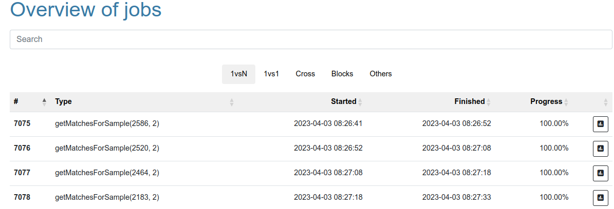

# MCRIT Web

This document outlines the different functionalities of the MCRIT web frontend.

## First Usage

After installation (e.g. via docker) and when starting MCRIT Web for the first time, you will be greeted with the following screen:

You will need to register your primary user first, which will automatically be assigned the `admin` role and have maximimum access rights.
It can also never be degraded from `admin`.

The server details allow you specify an MCRIT backend, which by default is listening on port 8000.
The `mcrit-server` hostname is the preset from `docker-mcrit`, if you are running a standalone deployment, you will also have to change the address, possibly to `127.0.0.1` or similar, depending on your setup.

If you want a multi-user instance, you can specify an optional registration token, allowing you to prohibit open registration on your server, e.g. when you want to have it facing to the open internet.

## Functionality

We will now give an overview of the different functional aspects and menus of MCRIT Web.

### Explore

The `explore` menu allows you to navigate and access the contents stored in your MCRIT instance.

#### Search

MCRIT provides a search interface, with which you can search various data points of stored families, samples, and functions.  
The search syntax either allows to simply use plain search terms or to prefix your search terms in order to limit the search to specific fields.

For example, when only looking for samples of a certain `family_name`, you could use:
* `family_name:my_malware`

The currently supported fields per category are:
* families:
  * family_id
  * family_name
* samples:
  * family_id
  * sample_id
  * sha256
  * filename
  * family
  * version
  * component
* functions:
  * family_id
  * sample_id
  * function_id
  * offset
  * pichash
  * function_name
  * num_instructions

Additionally, you can also use operands to further limit the term:
* `<`, `<=`, `>`, `>=` -> limit the range
* `!=` -> not equal
* `!` -> logical not
* `?` -> interpret as regular expression

Furthermore, search terms can be combined using the `AND` and `OR` directives, e.g. like so:
* `family_id:1 AND offset:<=0x2399fff AND offset:>=0x2398fff`

#### Families

By default, there will be always a family with `family_id=0`, which is reserved for all samples that have not been assigned to another family with a `family_name`.
The list of families gives a quick overview on how many samples there are for a given family and if the family is considered a library.
The search bar allows using the syntax described above to filter the list.

On the far right, there are four operations available to interact with the families:
* Matching: create a new matching job, and preselect this family
* Blocks: Run a Blocks analysis over the family, isolating all basic blocks unique to this family and trying to derive a YARA rule for the family
* Export: export all samples and their functions
* Edit: allows to change the family name, decide whether the family is a library or not, or delete the family

#### Samples

Similar to the families view, the samples view allows to inspect all samples in the MCRIT database.
The search bar allows using the syntax described above to filter the list.

The same operations as for families are available here as well:
* Matching: create a new matching job, and preselect this sample
* Blocks: Run a Blocks analysis over this sample, isolating all basic blocks unique to this sample and trying to derive a YARA rule for it
* Edit: allows to change the family name and version, decide whether the sample is a library or not, or delete the sample

#### Functions

Finally, the functions view provides a list of all functions.
The search bar allows using the syntax described above to filter the list.

From this view, you can create matching jobs for the function's sample.

When selecting a function shown in the table, you can open the function details.
This sub view provides more information about the function, including a rendering of its control flow graph and occurrency of its basic blocks across the database:

#### Statistics

Provides a short numerical summary of the MCRIT database contents.

### Analyze

The Analyze section is all about matching.
There are four different methods available.

#### Compare 1vsN

This mode allows you to create a matching job for a sample existing in the database, which will then be compared to all other samples.
Naturally, only one input sample can be selected and the search syntax described in the Explore section applies again:

For further options, you can
* choose if you want to force a new run with `Force Rematch` (e.g. in case families/samples were added/removed) or if you want to access a previous result, if existing.
* adjust the fuzziness for MinHash matching. 
  * Off: Only do PicHash matching, i.e. quasi-exact function matches.
  * Fast: requires 3 matching bads, tightens the results but drops many matches in the lower range.
  * Standard: requires 2 matching bands, which considerably filters the function candidates while not cutting off too many potential true positives.
  * Complete: requires just 1 matching band, which yields the maximum number of function candidates but also likely incurs many false positives.

#### Compare 1vs1

In case you only want to compare two samples with each other, this is the option to choose.
This usually delivers immediate results as the matching candidate are limited to only functions found in these samples.

#### Cross-Compare

When wanting to compare a group of samples among each others, use Cross-Compare.
Technically, this will trigger 1vsN matching jobs for all selected samples but will also generate a comparison matrix for all samples.
This matrix is automatically ordered using hierarchical clustering and its individual fields can be clicked to get to the respective 1vs1 comparison.
The view looks like this:

The coloring scheme indicating the matching score is as follows.
Lowest score is white (no matches) or grey, then moving to red, over yellow, to green, and ending up in blue tones for the best matching scores.  
Notice the strongest matches around the diagonal.

#### Query

When you want to match a sample against the database without adding it to the collection, you can use the Query instead.
This allows you to upload a single sample, have it disassembled, and performed a 1vsN matching job against the full database.

#### Result View

All matching jobs have a Result View that allows to inspect the matching results.
When not filtered, it is usually divided into these sections:

##### Job / Input Sample

Some meta data describing the matching job and reference sample

##### Best Family Matches

In the table, the best match per family is shown.

The Direct matching scores show a result that did not have ocurrence frequency weights applied. 
The left number is comparable to the score that BinDiff or Diaphora would show you.
The right now shows the score minus the share of functions that have been matched to libraries.

For the frequency matching scores, each function match is additionally weighted with how many families were matched, the more families the lower the weight.
This way, less relevant matches receive less influence, and th result is boosted towards families that are more likely to have a relationship to the input sample.

Finally, the unique field gives a percentage for how many functions have been uniquely matched with this family, serving futher as an indicator or family identification.

The filter icons in each row can be used to filter the results to a specific family or sample (showing a 1vs1 result).
The filters above the table can be used to limit the initial selection.

#### Best Library Matches

Similar to the family view but limited to families and samples that have the library flag.

#### MCRIT Diagram

The MCRIT diagram visualizes the aggregated matching information for the whole sample.
Each bar corresponds to one function (with 10 or more instructions) from the binary, sorted by virtual addresses from left to right and its size being proportional to the number of instructions.
The three major rows show the following aspects:
* frequency
* library matches
* best match into another family

The coloring per row is the following.  
For frequency, blue means the lowest amount of matches, going over green, yellow, red, and ending up purple.  
For libraries, green indicates a match with one library and red a match with multiple libraries  
For best match, dark blue indicates a PIC match (quasi-identical), and otherwise matches degrade from blue to green, to yellow, orange, and red.

#### Function Matches

Finally, the table at the bottom of the page shows all matches aggregated per function and the best matched function score.
Here, filtering can be used to isolate functions by score and in how many families they were matched.

When using the filter icon, only matches for the specific function_id will be shown.
This also allows to select a match, for which a BinDiff-like function comparison can be rendered:

Here, blue indicates PIC matches (solid blue is indexed, light blue ad-hoc matched), green indicates a full match, yellow orange a partial match and red diversion that was too strong to be matched.

### Data

The data section bundles import and export of data, including the upload of samples.

#### Import 

The import section allows you to push previously exported data into your MCRIT instance.
The data is integrated as seamlessly as possible, sorting samples under same family names if possible.

#### Export

This functionality allows to export samples by ID or everything at once.
Note that the "everthing" is only suitable for smaller databases.

#### Jobs / Queue

Most operations in MCRIT are implemented as asynchronous jobs that are processed from a queue.
In this section, you can view all of these jobs, categorized by their type.

### User / Settings

The last menu point allows you to access settings.

#### User Access Levels

When using a multi-user instance of MCRIT Web, this section allows management of all user accounts.
At this time, there are 4 user roles with different access rights implemented.
* `Pending`: A user that has just registered and was not assigned a role yet
* `Visitor`: A limited "read-only" role that can not add content to the MCRIT dataase but is allowed to create matching jobs and queries with a filesize up to 1MB
* `Contributor`: An account with full access rights
* `Admin`: A full account that can also manage other users and the server

#### User Settings

The user settings page allows user to edit their preferences.
On the home screen, name and registration date for the user are shown.
If the user has access level contributor or administrator, it further shows an apitoken.
This token can be used for API passthrough, using the MCRIT Web front-end as a relay when using the MCRIT python client to interact with (normally not exposed) MCRIT server.

Additionally, users with level contributor and above can also change their username and password.

All users with level visitor or above can also set a number of filter preferences, that are automatically applied to all matching results.

